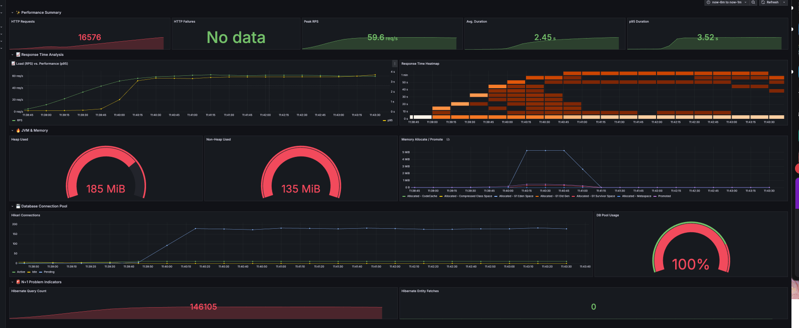
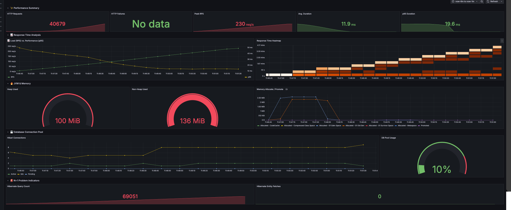
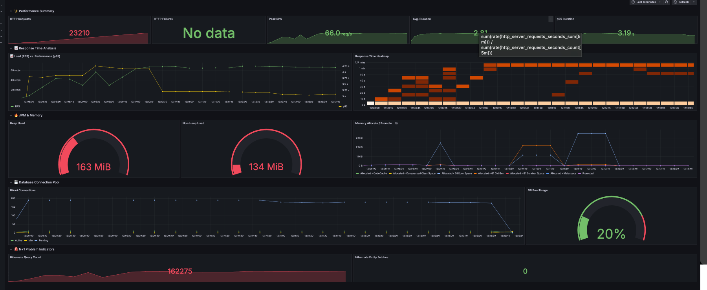

| 지표                         | N+1 방식                                  | Map Batch 방식                            | Native Query 방식                         |
|----------------------------|-------------------------------------------|-------------------------------------------|-------------------------------------------|
| **평균 응답 시간 (avg)**     | 2.5 s                                     | 12.3 ms                                   | 867 ms                                    |
| **95th Percentile (p95)**  | 3.46 s                                    | 20.6 ms                                   | 1.79 s                                    |
| **99th Percentile (p99)**  | 3.91 s                                    | —                                         | 2.51 s                                    |
| **Peak 처리량 (Peak RPS)**  | ~54 req/s                                 | ~123 req/s                                | ~197 req/s                                |
| **총 요청 수 (iterations)**  | 19,492                                    | 44,538                                    | 70,871                                    |
| **쿼리당 호출 수**           | 81 queries/request                        | 5 queries/request                         | 1–2 queries/request                       |
| **총 SQL 쿼리 수**           | ~146,000                                  | ~69,000                                   | ~3,500                                    |
| **Active DB Conn (peak)**   | 150–170                                   | 6–8                                       | ~170                                      |
| **풀 사용률**                | ~100 %                                    | ~10 %                                     | ~0 %                                      |
| **임계값 (thresholds)**      | p95<30 s, p99<60 s, 실패율<30 %           | p95<1 s,   p99<2 s,   실패율<10 %         | p95<2 s,   p99<3 s,   실패율<30 %         |
| **장점 / 한계**              | ❌ 대규모 N+1 쿼리 폭발 → 느린 응답<br>❌ 풀 포화로 병목 발생 | ✅ 94% 쿼리 절감 → 초저지연 / 고처리량<br>✅ 풀 여유로 안정성 확보 | ✔️ 최소 쿼리 수 → N+1 대비 대폭 개선<br>❗ Tail Latency(최대 지연) 추가 최적화 필요 |

🗺️ Map-Batch 최적화 (N+1 문제 해결)

1. 기존 N+1 문제 코드

// ❌ N+1 문제 발생 코드
public List<MeetingListResponse> getAllMeetings() {
List<Meeting> meetings = meetingRepository.findAll();

      return meetings.stream()
          .map(meeting -> {
              Member host = memberRepository.findById(meeting.getHostId()).get(); // N번 쿼리
              OutdoorSpot spot = outdoorSpotRepository.findById(meeting.getSpotId()).get(); // N번 
쿼리
Tag tag = tagRepository.findByMeetingId(meeting.getId()).get(); // N번 쿼리
Long count = participantRepository.countByMeetingId(meeting.getId()); // N번 쿼리
return MeetingListResponse.fromEntity(meeting, host, count, spot, tag);
})
.collect(Collectors.toList());
}

2. Map-Batch 최적화 코드

// ✅ Map-Batch로 N+1 문제 해결 (총 5개 쿼리만 실행)
@GetMapping("/meetings/map-optimized")
public ResponseEntity<BaseResponse<CustomSlicePageResponse<MeetingListResponse>>>
getAllListMeetingsMapOptimized(
@RequestParam(name = "cursorId", defaultValue = "0") Long cursorId,
@RequestParam(name = "size", defaultValue = "10") Integer size
) {
Slice<Meeting> meetings = meetingService.getAllMeetings(cursorId, size);
List<Meeting> meetingList = meetings.getContent();

      // 🎯 1. 모든 ID 수집
      Set<Long> hostIds = meetingList.stream().map(Meeting::getHostId).collect(Collectors.toSet());
      Set<Long> spotIds = meetingList.stream().map(Meeting::getSpotId).collect(Collectors.toSet());
      List<Long> meetingIds =
meetingList.stream().map(Meeting::getId).collect(Collectors.toList());

      // 🎯 2. Batch 조회 (5개 쿼리만!)
      Map<Long, Member> hostMap = memberRepository.findAllById(hostIds)
          .stream().collect(Collectors.toMap(Member::getId, m -> m));

      Map<Long, OutdoorSpot> spotMap = outdoorSpotRepository.findAllById(spotIds)
          .stream().collect(Collectors.toMap(OutdoorSpot::getId, s -> s));

      Map<Long, Tag> tagMap = tagRepository.findByMeetingIdIn(meetingIds)
          .stream().collect(Collectors.toMap(Tag::getMeetingId, t -> t));

      Map<Long, Long> participantCountMap = participantRepository.countByMeetingIdIn(meetingIds)
          .stream().collect(Collectors.toMap(
              result -> (Long) result[0],      // meetingId
              result -> (Long) result[1]       // count
          ));

      // 🎯 3. 메모리에서 조합 (추가 쿼리 없음!)
      List<MeetingListResponse> dtoList = meetingList.stream()
          .map(meeting -> {
              Member host = hostMap.get(meeting.getHostId());
              OutdoorSpot spot = spotMap.get(meeting.getSpotId());
              Tag tag = tagMap.get(meeting.getId());
              Long participantCount = participantCountMap.getOrDefault(meeting.getId(), 0L);
              return MeetingListResponse.fromEntity(meeting, host, participantCount, spot, tag);
          })
          .collect(Collectors.toList());

      // 나머지 페이징 로직...
      return BaseResponse.success(result);
}

3. Native Query 최적화 (Repository 레벨)

// ✅ 하나의 Native Query로 모든 데이터 조회
```
@Query(value = """
SELECT
m.id,
m.title,
m.category,
m.capacity,
m.host_id,
m.meeting_time,
m.status,
m.spot_id,
m.created_at,
mb.nickname,
s.id,
s.name,
s.location,
t.content,
COALESCE(p_count.participant_count, 0)
FROM meetings m
LEFT JOIN members mb ON m.host_id = mb.id
LEFT JOIN outdoor_spots s ON m.spot_id = s.id
LEFT JOIN tags t ON m.id = t.meeting_id
LEFT JOIN (
SELECT meeting_id, COUNT(*) as participant_count
FROM meeting_participants
GROUP BY meeting_id
) p_count ON m.id = p_count.meeting_id
ORDER BY m.created_at DESC, m.id DESC
LIMIT :size
""", nativeQuery = true)
List<Object[]> findAllWithAssociationsOptimized(@Param("size") int size);
```

🎯 성능 비교

| 방식           | 쿼리 수                       | 성능      |
  |--------------|----------------------------|---------|
| 기존 N+1       | 1 + N×4 = 41개 (10개 데이터 기준) | ❌ 느림    |
| Map-Batch    | 5개 고정                      | ✅ 빠름    |
| Native Query | 1개                         | ✅ 가장 빠름 |

N+1

█ THRESHOLDS

    errors
    ✓ 'rate<0.3' rate=0.00%

    http_req_duration
    ✓ 'p(95)<30000' p(95)=3.46s
    ✓ 'p(99)<60000' p(99)=3.91s

    http_req_failed
    ✓ 'rate<0.3' rate=0.00%

█ TOTAL RESULTS

    checks_total.......................: 58476   162.237831/s
    checks_succeeded...................: 100.00% 58476 out of 58476
    checks_failed......................: 0.00%   0 out of 58476

    ✓ N+1 status is 200
    ✓ N+1 has meeting data
    ✓ N+1 response time < 30s

    CUSTOM
    errors..................................................................: 0.00%  0 out of 0

    HTTP
    http_req_duration.......................................................: avg=2.5s min=83.96ms  med=2.96s max=6.84s p(90)=3.35s p(95)=3.46s
      { expected_response:true }............................................: avg=2.5s min=83.96ms  med=2.96s max=6.84s p(90)=3.35s p(95)=3.46s
    http_req_failed.........................................................: 0.00%  0 out of 19492
    http_reqs...............................................................: 19492  54.079277/s

    EXECUTION
    dropped_iterations......................................................: 25058  69.521779/s
    iteration_duration......................................................: avg=2.7s min=190.49ms med=3.16s max=7.06s p(90)=3.55s p(95)=3.67s
    iterations..............................................................: 19492  54.079277/s
    vus.....................................................................: 0      min=0          max=200
    vus_max.................................................................: 200    min=50         max=200

    NETWORK
    data_received...........................................................: 170 MB 472 kB/s
    data_sent...............................................................: 2.5 MB 7.0 kB/s

Map_BATCH

█ THRESHOLDS

    errors
    ✓ 'rate<0.1' rate=0.00%

    http_req_duration
    ✓ 'p(95)<1000' p(95)=20.57ms
    ✓ 'p(99)<2000' p(99)=37.17ms

    http_req_failed
    ✓ 'rate<0.1' rate=0.00%

█ TOTAL RESULTS

    checks_total.......................: 178152  494.961105/s
    checks_succeeded...................: 100.00% 178152 out of 178152
    checks_failed......................: 0.00%   0 out of 178152

    ✓ Map Batch status is 200
    ✓ Map Batch has meeting data
    ✓ Map Batch response time < 10s
    ✓ Map Batch very fast response < 1s

    CUSTOM
    errors..................................................................: 0.00%  0 out of 0

    HTTP
    http_req_duration.......................................................: avg=12.25ms  min=3.57ms  med=10.82ms  max=118.51ms p(90)=15.17ms  p(95)=20.57ms 
      { expected_response:true }............................................: avg=12.25ms  min=3.57ms  med=10.82ms  max=118.51ms p(90)=15.17ms  p(95)=20.57ms 
    http_req_failed.........................................................: 0.00%  0 out of 44538
    http_reqs...............................................................: 44538  123.740276/s

    EXECUTION
    dropped_iterations......................................................: 11     0.030561/s
    iteration_duration......................................................: avg=112.93ms min=59.59ms med=112.68ms max=441.86ms p(90)=152.87ms p(95)=157.91ms
    iterations..............................................................: 44538  123.740276/s
    vus.....................................................................: 0      min=0          max=32
    vus_max.................................................................: 61     min=50         max=61

Native_Query

█ THRESHOLDS

    errors
    ✓ 'rate<0.3' rate=0.00%

    http_req_duration
    ✓ 'p(95)<30000' p(95)=7.04s
    ✓ 'p(99)<60000' p(99)=7.93s

    http_req_failed
    ✓ 'rate<0.3' rate=0.00%

█ TOTAL RESULTS

    checks_total.......................: 68769   190.77656/s
    checks_succeeded...................: 100.00% 68769 out of 68769
    checks_failed......................: 0.00%   0 out of 68769

    ✓ N+1 status is 200
    ✓ N+1 has meeting data
    ✓ N+1 response time < 30s

    CUSTOM
    errors..................................................................: 0.00%  0 out of 0

    HTTP
    http_req_duration.......................................................: avg=4.23s min=80.03ms  med=3.39s max=11.27s p(90)=6.11s p(95)=7.04s
      { expected_response:true }............................................: avg=4.23s min=80.03ms  med=3.39s max=11.27s p(90)=6.11s p(95)=7.04s
    http_req_failed.........................................................: 0.00%  0 out of 22923
    http_reqs...............................................................: 22923  63.592187/s

    EXECUTION
    dropped_iterations......................................................: 28003  77.684945/s
    iteration_duration......................................................: avg=4.43s min=189.76ms med=3.61s max=11.42s p(90)=6.3s  p(95)=7.26s
    iterations..............................................................: 22923  63.592187/s
    vus.....................................................................: 0      min=0          max=400
    vus_max.................................................................: 400    min=250        max=400

    NETWORK
    data_received...........................................................: 200 MB 555 kB/s
    data_sent...............................................................: 3.0 MB 8.2 kB/s

running (6m00.5s), 000/400 VUs, 22923 complete and 0 interrupted iterations
n_plus_1_load_test     ✓ [======================================] 000/200 VUs  6m0s  001.29 iters/s
n_plus_1_max_load_test ✓ [======================================] 200 VUs      3m0s 